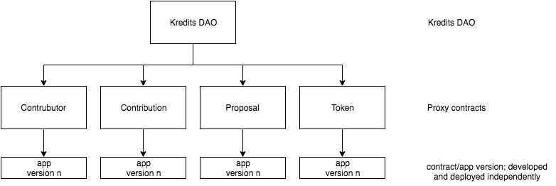

# Kredits Contracts

This repository contains the Solidity smart contracts organized as [Aragon](https://hack.aragon.org/) 
apps and JavaScript API wrapper for [Kosmos Kredits](https://wiki.kosmos.org/Kredits).

It is based on [aragonOS](https://hack.aragon.org/docs/aragonos-intro.html) and 
follows the aragonOS conventions.
Aragon itself uses the [Truffle framework](http://truffleframework.com/) for some things.

## Development

### Installation

All requirements are defined in `package.json`.

    $ npm install

Each of the aragon apps are separate packages:

    $ cd apps/[app]
    $ npm install

or use the bootstrap command (see below)

### Local development chain

For local development it is recommended to use 
[ganache](http://truffleframework.com/ganache/) to run a local development 
chain. Using the ganache simulator no full Ethereum node is required.

We use the default aragon-cli devchain command to confgure and run a local 
development ganache.

    $ npm run devchain (or aragon devchain --port 7545)

To clear/reset the chain use: 

    $ npm run devchain -- --reset (or aragon devchain --port 7545 --reset)

We default to port 7545 for development to not get in conflict with the default 
Ethereum RPC port.

### Bootstrap

1. Run an Ethereum node and ipfs
    
        $ npm run devchain
        $ ipfs daemon

2. Deploy each app to the devchain

        $ npm run deploy:apps

3. Deploy a new KreditsKit and create a new DAO with the latest app versions

        $ npm run deploy:kit
        $ npm run deploy:dao

4. Execute seeds to create demo contributors, contributons, etc. (optional) 

        $ npm run seeds

**Step 2-4 is also summarized in `npm run bootstrap`**

## Contract architecture

Contracts are organized in independent apps (see `/apps`) and are developed 
and deployed independently. Each app has a version and can be "installed" 
on the Kredits DAO independently.

A DAO can be deployed using the `scripts/deploy-kit.js` script or with the 
`npm run deploy:dao` command. This deploys a new Kredits DAO, installs
the latest app versions and sets the required permissions.

See each app in `/apps/*` for details.

## Helper scripts

`scripts/` contains some helper scripts to interact with the contracts from the
CLI. _At some point these should be moved into a real nice CLI._

To run these scripts use `truffle exec`. For example: `truffle exec
scripts/add-proposal.js`.

### cli.js

Call any function on any contract:

    $ truffle exec scripts/cli.js

### repl.js

Similar to cli.js but only provides a REPL with an initialized `kredits`
instance.

    $ truffle exec scripts/repl.js

### add-{contributor, contribution, proposal}.js

Script to add a new entries to the contracts using the JS wrapper

    $ truffle exec scripts/add-{contributor, contribution, proposal}.js

### list-{contributor, contribution, proposal}.js

List contract entries

    $ truffle exec scripts/list-{contributor, contribution, proposal}.js

### send-funds.js

Sends funds to an address. Helpful in development mode to for example fund a
metamask account.

    $ truffle exec scripts/send-funds.js

### seeds.js

Run seeds defined in `config/seeds.js`.

    $ truffle exec scripts/seeds.js
    or
    $ npm run seeds

### current-address.js

Prints all known DAO addresses and the DAO address for the current network

    $ truffle exec scripts/current-address.js
    or
    $ npm run dao:address

### deploy-kit.js

Deploys a new KreditsKit that allows to create a new DAO

    $ truffle exec script/deploy-kit.js
    or
    $ npm run deploy:kit

`ENS` address is required as environment variable.  
`DAO_FACTORY` can optionally be set as environment variable. (see aragon)

### new-dao.js

Creates and configures a new DAO instance.

    $ truffle exec script/new-dao.js
    or
    $ npm run deploy:dao

KreditsKit address is load from `lib/addresses/KreditsKit.json` or can be 
configured through the `KREDITS_KIT` environment variable.

### deploy-apps.sh

Runs `npm install` for each app and publishes a new version.

    $ ./scripts/deploy-apps.sh
    or
    $ npm run deploy:apps

## ACL / Permissions

## Upgradeable contracts

We use aragonOS for upgradeablity of the different contracts.
Refer to the [aragonOS upgradeablity documentation](https://hack.aragon.org/docs/upgradeability-intro) 
for more details.

### Example

1. Setup (see #Bootstrap)
    1. Deploy each contract/apps (see `/apps/*`)
    2. Create a new DAO (see scripts/deploy-kit.js)
2. Update
    1. Deploy a new Version of the contract/app (see `/apps/*`)
    2. Use the `aragon dao upgrade` command to "install" the new version for the DAO
      (`aragon dao upgrade <DAO address> <app name>`)

## Known Issues

When resetting ganache Metamask might have an invalid transaction nonce and
transactions get rejected. Nonces in Ethereum must be incrementing and have no
gap.

To solve this reset the metamask account (Account -> Settings -> Reset Account)
